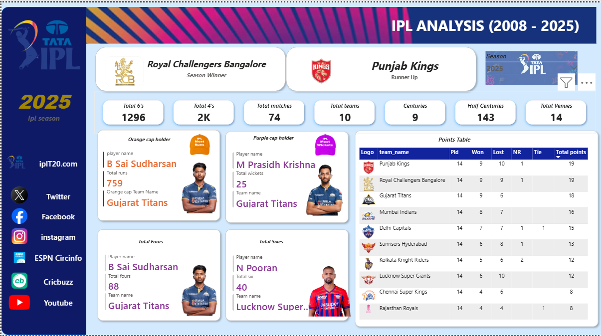

# 🏏 IPL Analysis Dashboard (2008–2025)

## 📊 Overview

This project is an interactive Power BI dashboard that analyzes IPL data across multiple seasons.
Users can dynamically explore performance metrics by selecting a specific year.

---

## 🔥 Key Features

* Year-wise dynamic filtering (2008–2025)
* Team performance analysis
* Player statistics:

  * Orange Cap (Most Runs)
  * Purple Cap (Most Wickets)
* Boundary analysis:

  * Total 4s and 6s
* Match insights:

  * Total matches, venues, teams
* Points Table visualization

---

## 🛠️ Tools & Technologies

* Power BI
* DAX (Data Analysis Expressions)
* Data Modeling

---

## 📈 Insights Generated

* Identified top-performing teams per season
* Player contribution analysis
* Trend of scoring (4s vs 6s)
* Team rankings comparison

---

## 📂 Project Files

* `IPL_Analysis_Dashboard.pbix` → Main dashboard
* `dashboard.png` → Dashboard preview
* `dataset.csv` → Dataset used

---

## 🖼️ Dashboard Preview

---

## 🚀 How to Use

1. Download the `.pbix` file
2. Open in Power BI Desktop
3. Use the year slicer (top right) to explore data

---

## 💡 Future Improvements

* Add predictive analysis (ML integration)
* Player comparison dashboard
* Real-time data updates

---

## 📬 Contact

If you found this useful, feel free to connect with me!
